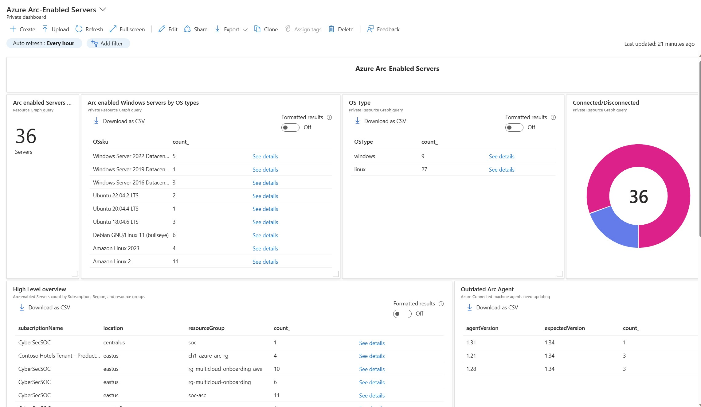
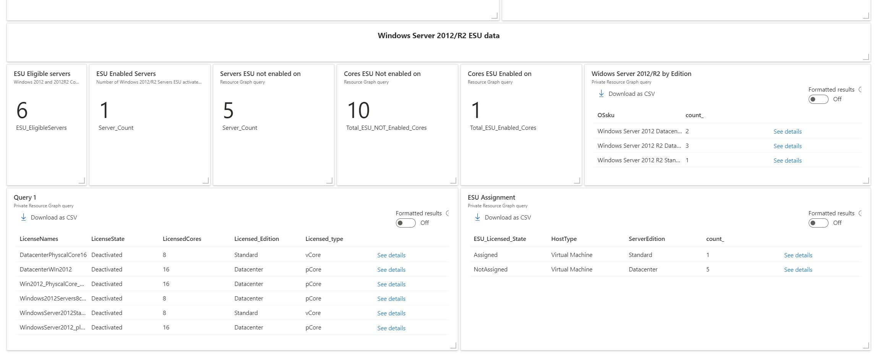
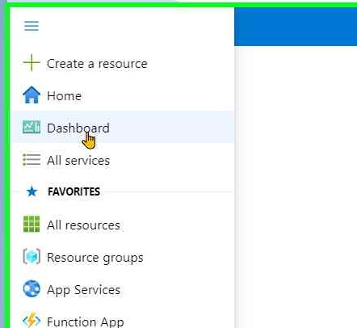
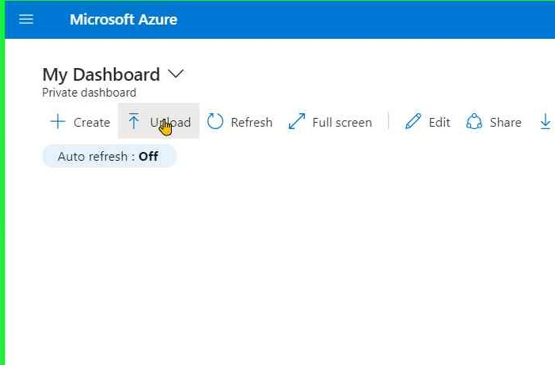
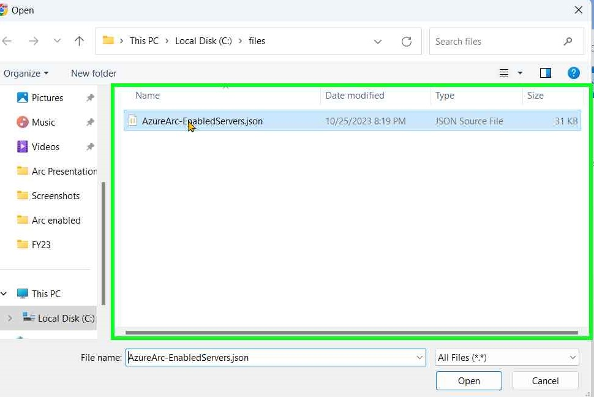
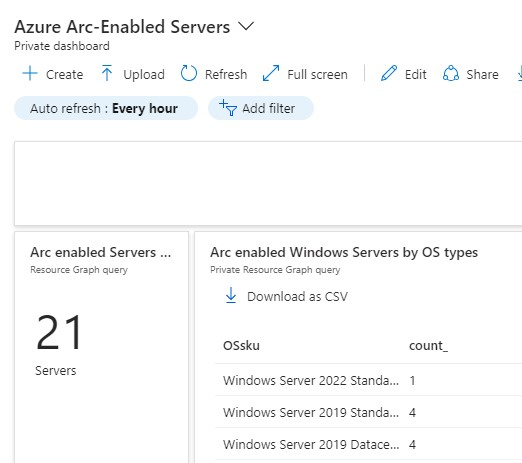

# Azure Arc-enabled Servers dashboard

This dashboard gives you an executive view of your Arc-enabled server environment. 
The  dashboard is broken into  __2 sections__; Arc-enabled Servers and Windows Server 2012/R2 ESU data. 
It's designed to be as simple as possible, yet give you enough information to review your environment in one simple glance

#### Arc-enabled Servers section
  * Breakdown and count of Arc-enabled servers within your tenant.
  * Servers are categorized by OS types and corresponding counts.
  * Distinction between Linux and Windows systems.
  * Status classification of servers as Connected (Online) or Disconnected (Offline).
  * Identification of outdated Azure-connected machine agents.
   
#### Windows Server 2012/R2 section
   * Monitoring ESU licenses activated and assigned.
 * Number of servers eligible for ESU.
 * Servers are categorized as enabled or not enabled for ESU deployment.
 * Server core counts enabled or not enabled for ESU deployment.
 * Enumeration of Windows Server 2012/R2 editions and their corresponding counts.
 * Tracking the activation states of ESU licenses, whether they are Activated or Deactivated.
 * Counting the ESU-licensed Cores/pCores and distinguishing between those that are Assigned and Not Assigned.
 * Tracking ESU assignments and activation counts.

## Dashboard file
  The dashboard is in JSON format and can be downloaded as a file here -->
  [Azure Arc-Enabled Servers](files/AzureArc-EnabledServers.json)

  ## How to use it?

Importing this  dashboard to your Azure environment.

Follow this steps:

* Download the dashboard json  a file here -->   [Azure Arc-Enabled Servers](files/AzureArc-EnabledServers.json)
* Login to [Azure Portal](https://portal.azure.com/) 
* Go to ___'Azure Dashboard'___

   
&NewLine;

* Click on ___'+ Upload'___

    
&NewLine;

* Select   ___'+ AzureArc-EnabledServers.json'___ file and click _'Open'_

   
&NewLine;

__The dashboard is ready for use!__

&nbsp;
   
    
